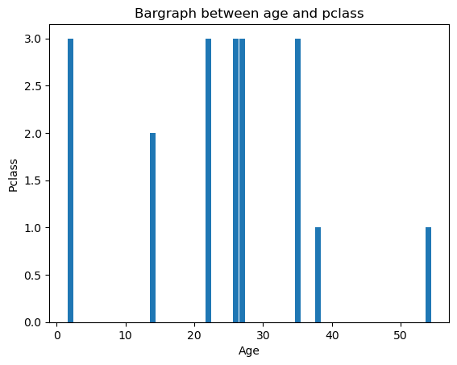
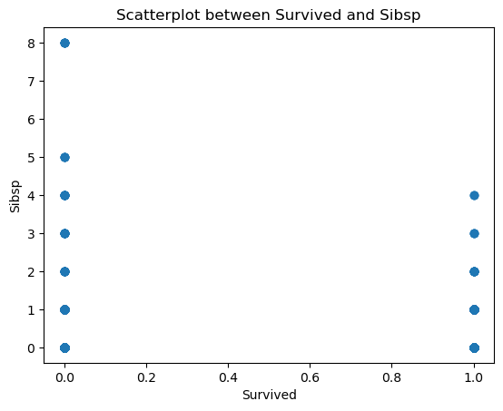
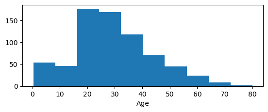
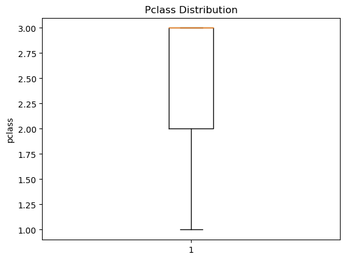
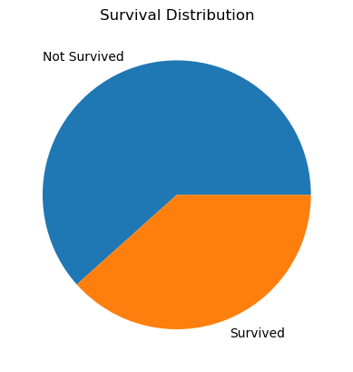
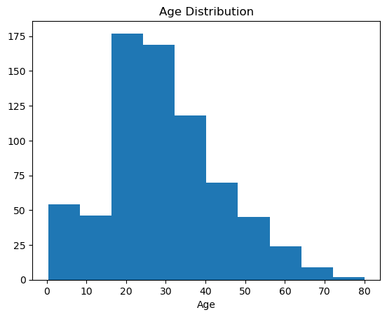

# EXNO-5-DS-DATA VISUALIZATION USING MATPLOT LIBRARY

# Aim:
  To Perform Data Visualization using matplot python library for the given datas.

# EXPLANATION:
Data visualization is the graphical representation of information and data. By using visual elements like charts, graphs, and maps, data visualization tools provide an accessible way to see and understand trends, outliers, and patterns in data.

# Algorithm:
STEP 1:Include the necessary Library.

STEP 2:Read the given Data.

STEP 3:Apply data visualization techniques to identify the patterns of the data.

STEP 4:Apply the various data visualization tools wherever necessary.

STEP 5:Include Necessary parameters in each functions.

# Coding and Output:
```
import matplotlib.pyplot as plt 
import seaborn as sns 
df=sns.load_dataset('titanic')

plt.bar(df['age'].head(10),df['pclass'].head(10))
plt.title('Bargraph between age and pclass')
plt.xlabel('Age')
plt.ylabel('Pclass')
```



```
plt.scatter(df['survived'],df['sibsp'])
plt.title('Scatterplot between Survived and Sibsp')
plt.xlabel('Survived')
plt.ylabel('Sibsp')
```



```
plt.subplot(2, 1, 1)
plt.hist(df['age'])
plt.xlabel('Age')
```



```
plt.boxplot(x=df['pclass'])
plt.title('Pclass Distribution')
plt.ylabel('pclass')
```



```
s_counts = df['survived'].value_counts()
labels = ["Not Survived", "Survived"]
plt.pie(s_counts, labels=labels)
plt.title("Survival Distribution")
```



```
plt.hist(df['age'])
plt.title('Age Distribution')
plt.xlabel('Age')
```



# Result:
Data Visualization is performed using matplot python library for the given datas.

